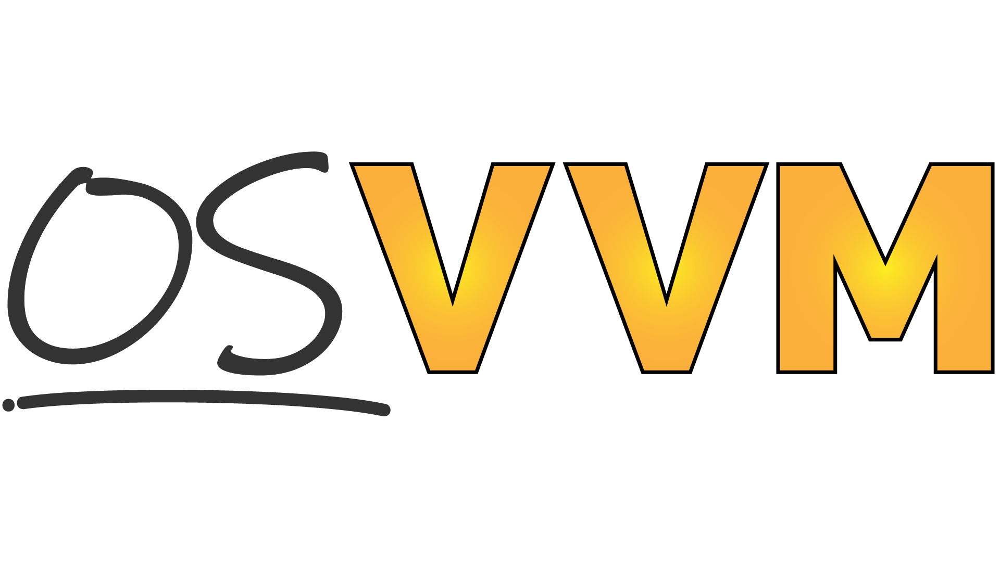

About OSVVM
####################################################

About OSVVM
====================================================

OSVVM is an advanced verification methodology that
defines a VHDL verification framework, verification utility library, 
verification component library, and a scripting flow
that simplifies your FPGA or ASIC verification project 
from start to finish.
Using these libraries you can create a simple, readable, 
and powerful testbench that is suitable for either a 
simple FPGA block or a complex ASIC.

OSVVM is developed by the same VHDL experts who
have helped develop VHDL standards.
We have used our expert VHDL skills to create
advanced verification capabilities that:  

- Are simple to use and work like built-in language features.  
- Maximize reuse and reduce project schedule.  
- Improve readabilty and reviewability by the whole team including software and system engineers.  
- Facilitate debug with HTML based test suite and test case reporting.  
- Support continuous integration (CI/CD) with JUnit XML test suite reporting.  
- Provide buzz word features including Constrained Random, Functional Coverage, Scoreboards, FIFOs, Memory Models, error logging and reporting, and message filtering.  
- Rival the verification capabilities of SystemVerilog + UVM.  

Important benefits of OSVVM:

* Each piece is independent
    * Add them to your current VHDL testbench incrementally.

* Verification framework that is
    * Simple enough to use on small blocks
    * So simple in fact that we don't need a "Lite" or "Easy" approach
    * It is powerful enough to use on large, complex FPGAs and ASICs
    * Using the same framework architecture for RTL, Core, and System tests facilitates reuse between them
    * Test cases are readable by RTL, verification, software, and system engineers
    * It is simple enough that you just need VHDL engineers and not verification specialists.
    * Our Model Independent Transactions (MIT) define a common set of transactions for Address Bus and Streaming Interfaces

* Verification utility library that
    * Simplifies Self-checking, Error handling, and Message Filtering
    * Implements Constrained Random, Functional Coverage, Scoreboards, FIFOs, Memory Models
    * Is simple to use and works like built-in language features

* Unmatched Test reporting
    * JUnit XML for use with continuous integration (CI/CD) tools.
    * HTML Build Summary Report for reporting test suite level information
    * HTML Test Case Detailed report for each test case.
    * HTML based Alert, Functional Coverage, and Scoreboard Reports
    * HTML based test transcript/log files
    * Find and debug issues faster

* Verification component library
    * Free open source verification components for AXI4 Full, AXI4 Lite, AXI Stream, UART, and DPRAM
    * More in progress

* One Script to Run Simulators
    * Same script supports GHDL, Aldec Riviera-PRO and ActiveHDL, Siemens QuestaSim and ModelSim, Synopsys VCS, and Cadence Xcelium

* It is free open source.
    * It upgrades an ordinary VHDL license with full featured verification capabilities.

SynthWorks has been using OSVVM for 25+ years in our
training classes and consulting work.
During that time, we have innovated new capabilities
and evolved our existing ones to increase
re-use and reduce effort and time spent.
