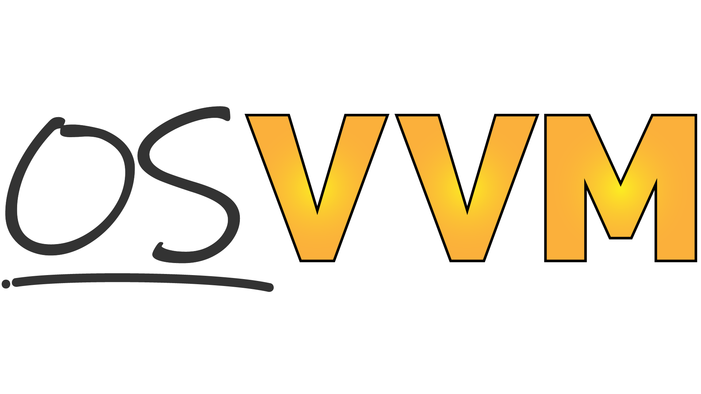

About OSVVM
####################################################

About OSVVM
====================================================

OSVVM is an advanced verification methodology that 
defines a VHDL verification framework, verification utility library, 
verification component library, scripting API, and co-simulation capability 
that simplifies your FPGA or ASIC verification project from start to finish. 
Using these libraries you can create a simple, readable, 
and powerful testbench that will boost productivity for either 
low level block tests (unit tests) or complex FPGA and ASIC tests.

OSVVM is developed by the same VHDL experts who
have helped develop VHDL standards.
We have used our expert VHDL skills to create
advanced verification capabilities that provide:  

**A structured transaction-based framework**

-  Suitable for all verification tasks – from Unit/RTL to full
   chip/system level tests.
-  Similar block diagram to SystemVerilog + UVM, except It plugs
   together just like RTL
-  Facilitates re-use of VC and test cases through all levels of testing
   (RTL to Full Chip)

**Model Independent Transaction (MIT) Library**

-  Defines Transaction API - procedures called by test case to build up
   sequences of interface operations - such as send, get, write, read
-  Defines Transaction Interface - connects Verification Component to
   Test Sequencer.
-  Used by all OSVVM defined VC

**Simplified Verification component (VC) development**

-  Uses MIT library = building block level re-use.
-  Makes development of a VC as simple as writing a procedure.
-  No OO or fork and join - uses natural concurrency of a VHDL
   entity/architecture
-  Any VHDL engineer can do this

**Readable Test cases**

-  Simplified since all VC of a similar type implement a subset of the
   MIT transaction calls (send, get, …)
-  Directed tests or complex, randomized tests can be written by any
   VHDL engineer
-  Readable and reviewable by the whole team including software and
   system engineers.

**Unmatched Test Reports**

-  Build Summary - HTML (for humans) + JUnit XML (for CI tools)
-  Test Cases - HTML
-  Logs - HTML + plain text
-  Requirements Tracking - HTML + CSV
-  Helps Find and Debug issues faster

**Powerful verification utilities that make VHDL a full verification
language, including**

-  Constrained Random, Functional Coverage, Scoreboards, FIFOs, Memory
   Models, error logging and reporting (alerts), and message filtering
   (logs).
-  Capabilities are simple to use, concise, and work like built-in
   language features.

**Requirements Tracking**

-  Tracked using both OSVVM's affirmations and functional coverage
-  Tracks a count of each requirement and not just a boolean type check.

**A Common Scripting API**

-  Same script runs all simulators – including GHDL, NVC, Aldec
   Riviera-PRO and ActiveHDL, Siemens Questa and ModelSim, Synopsys VCS,
   Cadence Xcelium, and Xilinx XSIM.
-  Is an API on top of Tcl
-  Most scripts are just slightly more than a list of files
-  Can run Tcl when you need it - usually no Tcl is required

**Free, Open Source Verification Components include**

-  AXI Full and Lite, AxiStream, Wishbone, UART, xMII, SPI, DpRam,
   VideoBus.

**Co-simulation**

-  Supports running software (C++) in a hardware simulation environment.
-  Write test cases in C++
-  Run C++ models such as instruct set simulators

**Architected by a long-time IEEE VHDL working group contributor**

-  So expect better VHDL implementations.

**It is Free, Open Source under APACHE 2.0**

-  Upgrades an ordinary VHDL license to a full featured verification
   capabilities
-  `On GitHub <https://github.com/osvvm/OsvvmLibraries>`__ and IEEE Open
   Source.
-  We accept issues and pull requests on GitHub.
-  Join us.

**Get similar verification capabilities to SystemVerilog + UVM without needing OO.**

Looking to improve your VHDL verification methodology? 
OSVVM provides a complete solution for VHDL ASIC or FPGA verification. 
There is no new language to learn. 
It is simple, powerful, and concise. 
Each piece can be used separately. 
Hence, you can learn and adopt pieces as you need them.  

SynthWorks has been using OSVVM for 25+ years in our
training classes and consulting work.
During that time, we have innovated new capabilities
and evolved our existing ones to increase
re-use and reduce effort and time spent.
