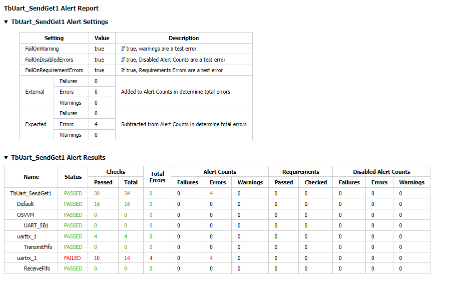
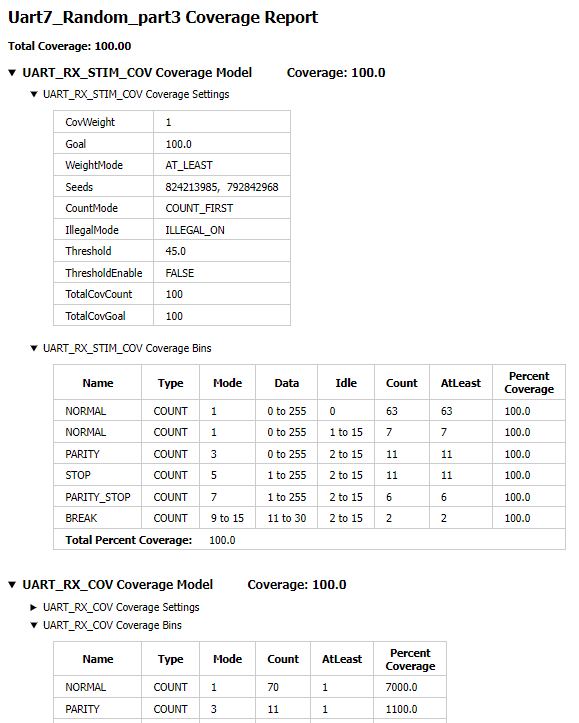
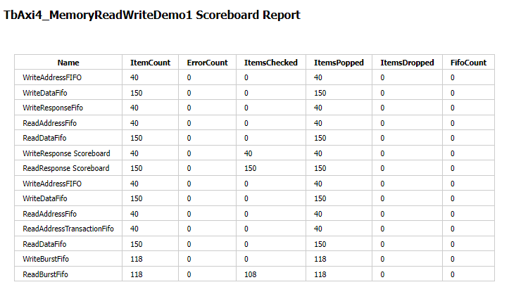

OSVVM Reports
####################################################

OSVVM's Reports
==================================
Good reports simplify debug and help find problems quickly. 
This is important as according to the 
`2020 Wilson Verification Survey FPGA  <https://blogs.sw.siemens.com/verificationhorizons/2020/12/02/part-4-the-2020-wilson-research-group-functional-verification-study/>`__
verification engineers spend 46% of their time debugging.

OSVVM produces the following reports:   

- HTML Build Summary Report for human inspection that provides test completion status.  
- JUnit XML Build Summary Report for use with continuous integration (CI/CD) tools.   
- HTML Test Case Detailed report for each test case with Alert, Functional Coverage, and Scoreboard reports.  
- HTML based simulator transcript/log files (simulator output)  
- Text based test case transcript file (from TranscriptOpen)  

The best way to see the reports is to look at the ones from the demo. 
If you have not already done ``build OsvvmLibraries/RunDemoTests.pro``, 
then do so now.

HTML Build Summary Report
-------------------------------------------
The Build Summary Report allows us to quickly confirm if a 
build passed or quickly identify which test cases did not PASS. 

The Build Summary Report has three distinct pieces:  

- Build Status   
- Test Suite Summary   
- Test Case Summary   

For each Test Suite and Test Case, there is additional information,
such as Functional Coverage and Disabled Alert Count.

In the sim directory, the Build Summary Report is 
in the file OsvvmLibraries_RunDemoTests.html.
See :numref:`Figure {number} {name} <BuildSummaryReportFig>`.

.. figure:: images/DemoBuildSummaryReport.png
  :name: BuildSummaryReportFig
  :scale: 25 %
  :align: center
  
  Build Summary Report
  
Note that any place in the report there is a triangle preceding text,
pressing on the triangle will rotate it and either hide or reveal
additional information.

Build Status
~~~~~~~~~~~~~~~~~~~~~~~~~~~~~~~~
The Build Status is in a table at the top of the 
Build Summary Report. 
It is shown in :numref:`Figure {number} {name} <BuildStatusFig>`.
If code coverage is run, there will be a link to 
the results at the bottom of the Build Summary Report.

.. figure:: images/DemoBuildStatus.png
  :name: BuildStatusFig
  :scale: 50 %
  :align: center
  
  Build Status

Test Suite Summary
~~~~~~~~~~~~~~~~~~~~~~~~~~~~~~~~~~
When running tests, test cases are grouped into test suites.
A build can include multiple test suites.
The next table we see in the Build Summary Report is the
Test Suite Summary.  
:numref:`Figure {number} {name} <TestSuiteSummaryFig>` shows 
that this build includes the test suites Axi4Full, AxiStream, and UART.

.. figure:: images/DemoTestSuiteSummary.png
  :name: TestSuiteSummaryFig
  :scale: 50 %
  :align: center
  
  Test Suite Summary

Test Case Summary
~~~~~~~~~~~~~~~~~~~~~~~~~~~~~~~~~~
The remainder of the Build Summary Report is Test Case Summary.
There is a seprate Test Case Summary for each test suite in the build.
See :numref:`Figure {number} {name} <TestCaseSummaryFig>`.

.. figure:: images/DemoTestCaseSummaries.png
  :name: TestCaseSummaryFig
  :scale: 50 %
  :align: center
  
  Test Case Summary

 
JUnit XML Build Summary Report
-------------------------------------------
The JUnit XML Build Summary Report works with 
continuous integration (CI/CD).   
The CI/CD tools use this to understand if the test
is passing or not.
They also have facilities for displaying the 
report - however, the OSVVM HTML format provides
a superset of information.

OSVVM runs regressions on GitHub.  

HTML Test Case Detailed Report
------------------------------------------
For each test case that is run (simulated), 
a Test Case Detailed Report is produced that
contains consists of the following information:  

- Test Information Link Table  
- Alert Report  
- Functional Coverage Report(s)  
- Scoreboard Report(s)  
- Link to Test Case Transcript (opened with Transcript Open)   
- Link to this test case in HTML based simulator transcript  

After running one of the regressions, open one of the HTML files 
in the directory ./reports/<test-suite-name>. 

Note that any place in the report there is a triangle preceding text,
pressing on the triangle will rotate it and either hide or reveal
additional information.

Test Information Link Table
~~~~~~~~~~~~~~~~~~~~~~~~~~~~~~~~~~
The Test Information Link Table is in a table at the top of the 
Test Case Detailed Report. 
:numref:`Figure {number} {name} <TestInfoFig>`
has links to the Alert Report (in this file),
Functional Coverage Report (in this file),
Scoreboard Reports (in this file),
a link to simulation results (if the simulation report is in HTML),
and a link to any transcript files opened by OSVVM.

.. figure:: images/DemoTestCaseLinks.png
  :name: TestInfoFig
  :scale: 50 %
  :align: center
  
  Test Information Link Table

Alert Report
~~~~~~~~~~~~~~~~~~~~~~~~~~~~~~~~~~
The Alert Report provides detailed information for each AlertLogID
that is used in a test case.   
See :numref:`Figure {number} {name} <AlertFig>`

  
  Alert Report

Functional Coverage Report(s)
~~~~~~~~~~~~~~~~~~~~~~~~~~~~~~~~~~
The Test Case Detailed Report contains a 
Functional Coverage Report for each 
functional coverage model used in the test case.
See :numref:`Figure {number} {name} <FunctionalCoverageFig>`.
Note this report is not from the demo.

  
  Functional Coverage Report

Scoreboard Report(s)
~~~~~~~~~~~~~~~~~~~~~~~~~~~~~~~~~~
The Test Case Detailed Report contains a 
Scoreboard Report for each 
scoreboard model used in the test case.
See :numref:`Figure {number} {name} <ScoreboardFig>`

  
  Scoreboard Report

Test Case Transcript
-------------------------------------------
OSVVM's transcript utility facilitates collecting all 
test output to into a single file.  

:numref:`Figure {number} shows the {name} <TestCaseTranscriptFig>`

.. figure:: images/DemoVHDLTranscript.png
  :name: TestCaseTranscriptFig
  :scale: 50 %
  :align: center
  
  Test Case Transcript

HTML Simulator Transcript
-------------------------------------------
Simulator transcript files can be long.  
The basic OSVVM regression test (OsvvmLibraries/RunAllTests.pro),
produces a log file that is 84K lines long.  
As a plain text file, this is not browsable, however,
when converted to an html file it is.
OSVVM gives you the option to create either html (default) or plain text.

:numref:`Figure {number} shows the {name} <SimTranscriptFig>`

.. figure:: images/DemoSimTranscript.png
  :name: SimTranscriptFig
  :scale: 50 %
  :align: center
  
  HTML Simulator Transcript
