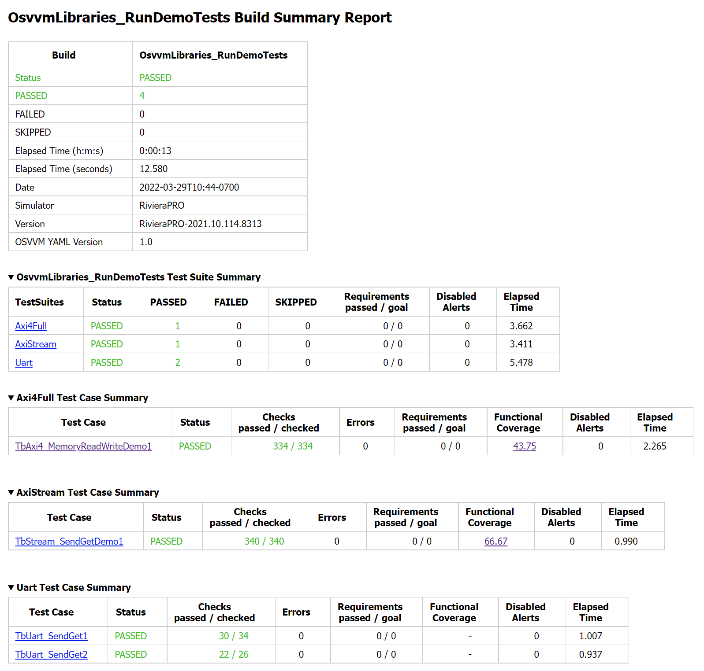
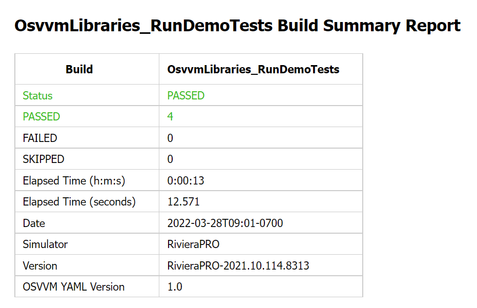
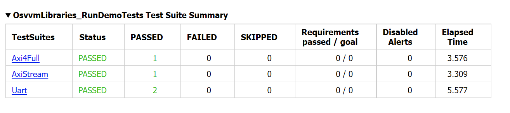
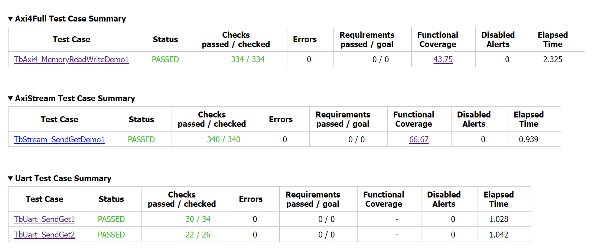
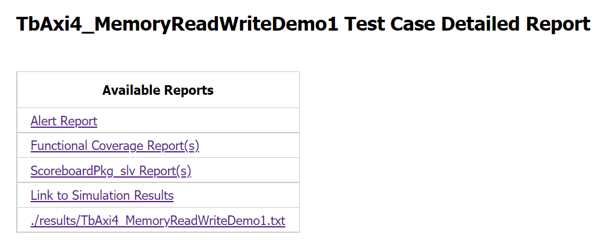
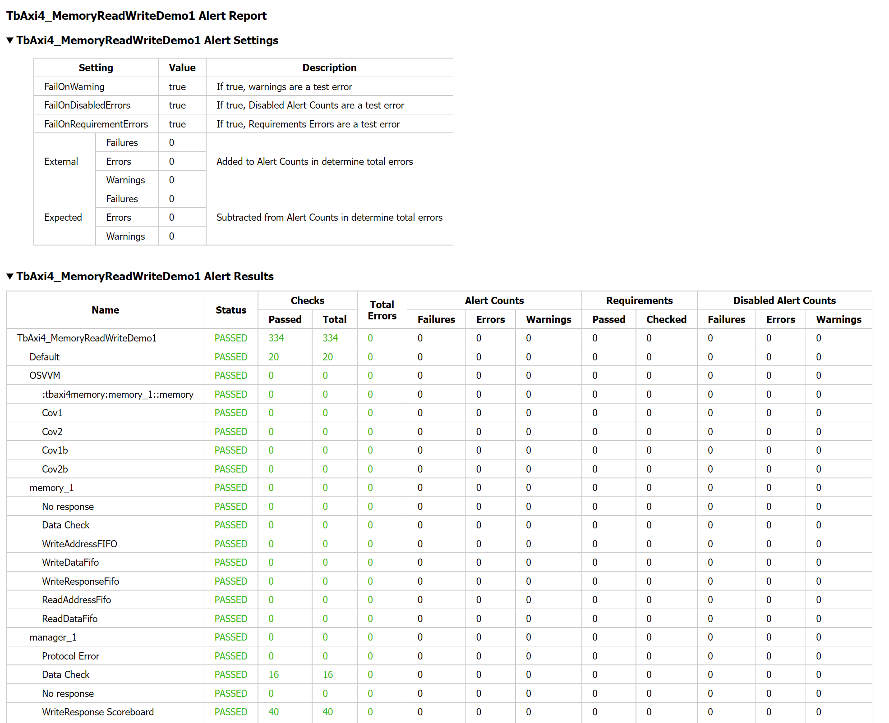
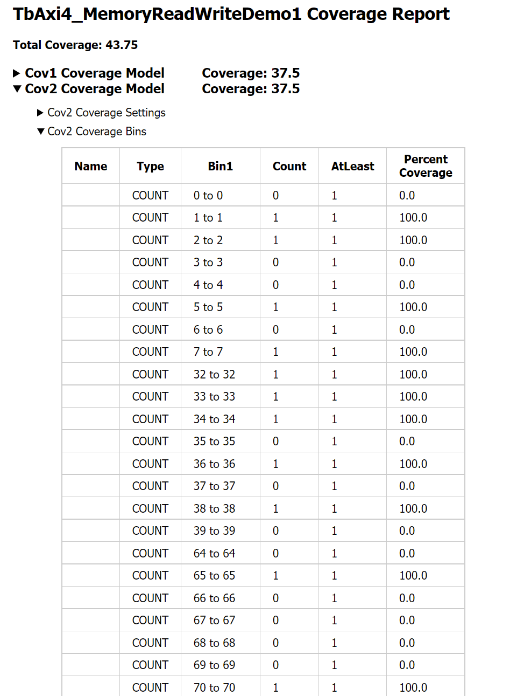
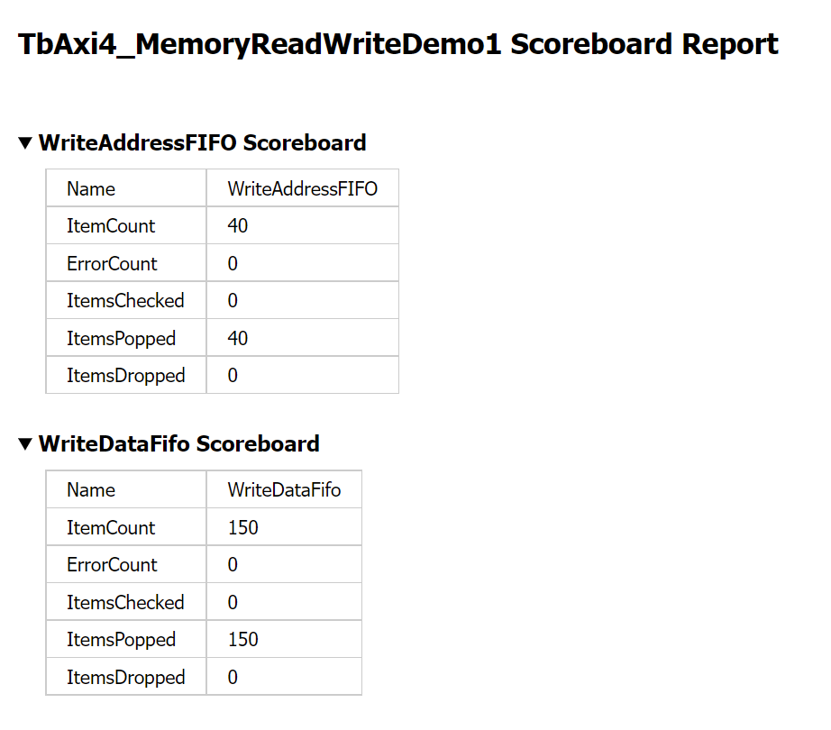

OSVVM Reports
####################################################

OSVVM Reports
====================================================
If you did not run the demos in the last step, if you
go back and do it, you can explore a live version of 
OSVVM's reports.

Good reports simplify debug and help find problems 
quickly.   
This is important as
according to the `2020 Wilson Verification Survey <https://blogs.sw.siemens.com/verificationhorizons/2020/12/02/part-4-the-2020-wilson-research-group-functional-verification-study/>`_
FPGA verification engineers spend 46% of their time debugging.

Lets take a look at the reports created in the demo.

Explore the Build Summary Report
----------------------------------------------------
In your sim directory, open the file OsvvmLibraries_RunDemoTests.html
in an internet browser.  This is OSVVM's Build Summary Report.
See :numref:`Figure {number} {name} <BuildSummaryReportFig>`.

  
  Build Summary Report

To run tests in OSVVM, you call build to initiate a sequence of
commands.   This is much like source (or do) except OSVVM's
build (and include) track where the script is running from so
user level scripts do not need to.

The first thing you find in the Build Summary Report is the
overall status of the test. 
See :numref:`Figure {number} {name} <BuildSummaryFig>`.

  
  Build Summary Status

When running tests, test cases are grouped into test suites.
A build can include multiple test suites.
The next table we see in the Build Summary Report is the
Test Suite Summary.  
:numref:`Figure {number} {name} <TestSuiteSummaryFig>` shows 
that this build includes the test suites Axi4Full, AxiStream, and UART.

  
  Test Suite Summary

Note that any place in the report there is a triangle preceding text
(such as the one above),
pressing on the triangle will rotate it and hide the information.
Pressing it again will reveal the hidden information.

The final set of tables in the Build Summary Report is the
Test Case Summary.  
See :numref:`Figure {number} {name} <TestCaseSummaryFig>`.
This table contains pass/fail information
for each test case in the test suite.

  
  Test Case Summary

Explore the Test Case Detailed Report
----------------------------------------------------
In the Test Case Summary for Axi4Full, click on TbAxi4_MemoryReadWriteDemo1.
This will load the Test Case Detailed Report.

The first item in the Test Case Detailed Report is an HTML table of
the available reports.
See :numref:`Figure {number} {name} <TestCaseDetailedReportFig>`.
The table for TbAxi4_MemoryReadWriteDemo1, shown below,
has links to the Alert Report (in this file),
Functional Coverage Report (in this file),
Scoreboard Reports (in this file),
a link to simulation results (if the simulation report is in HTML),
and a link to any transcript files opened by OSVVM.

  Test Case Detailed Report

The next item in the Test Case Detailed Report is the Alert Report.
See :numref:`Figure {number} {name} <AlertReportFig>`.

  Alert Report

Note that any place in the report there is a triangle preceding text,
pressing on the triangle will rotate it and either hide or reveal
additional information.

If the test case collected functional coverage, then the next item in
the report is the Functional Coverage Report.   
See :numref:`Figure {number} {name} <FunctionalCoverageReportFig>`.

  Functional Coverage Report

If the test case had scoreboards, then the next item in
the report is the Scoreboard Report.   
See :numref:`Figure {number} {name} <ScoreboardReportFig>`.

  Scoreboard Report
